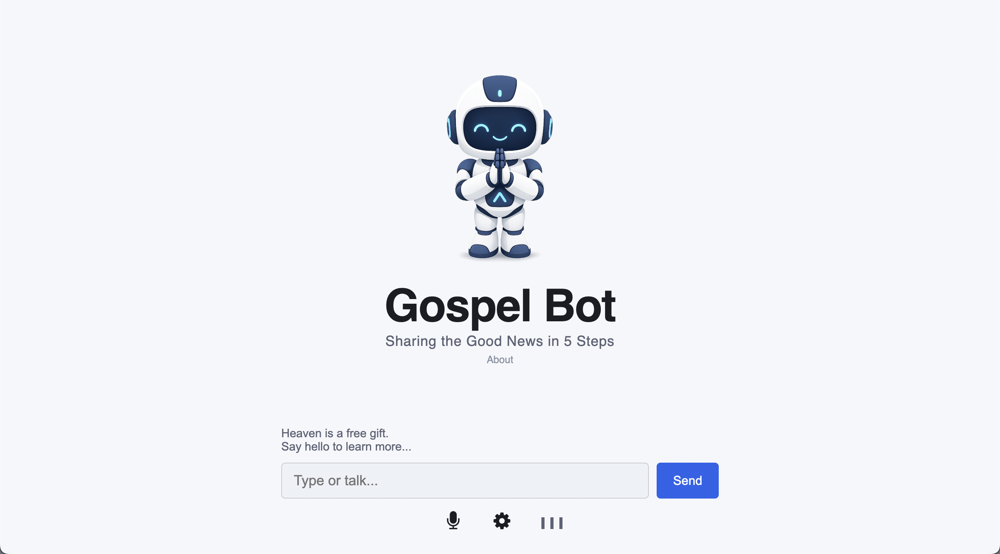
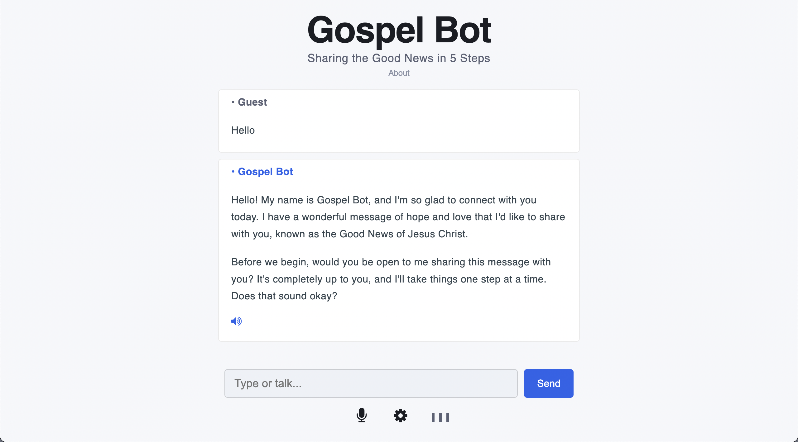

# Gospel Bot
An AI powered chatbot that respectfully shares the good news in 5 steps and leads people to Jesus.

Website: 
https://gospelbot.com/

 

 

 

## Quick Info
- Follows the Evangelism Explosion (EE) gospel presentation format.
- Minimalist UI design with light and dark modes
- Frontend: Html, CSS, Javascript
- Backend: PHP
- Uses the OpenRouter API (qwen3.5-flash-02-23 by Alibaba)
- Supports voice in and voice out.
- Uses Javascript SpeechRecognition to convert the user's speech into text
- Uses Javascript SpeechSynthesis to convert text to speech
- Has visual audio cues for deaf users
- Can be rebranded and self-hosted on any shared web hosting platform

  

## Deployment Notes

- Add your OpenRouter API key to the ebot_config.ini.txt file. 
- Then change the name of the file from ebot_config.ini.txt to ebot_config.ini before uploading to your web host server.
- For added security it's best to locate the ebot_config.ini file outside the web host root folder. This will protect your API key from being stolen.

 

## Notes
- The chatbot's voice quality on mobile is much better than voice quality on desktop.
- Auto speak can be turned off in the settings menu.
- The Qwen model supports more than 70 languages. Gospel Bot can be easily modified to chat in a different language.

 

## Revision History

Version 1.0 
20-Sept-2026 
Prototype. Released for testing.

 
